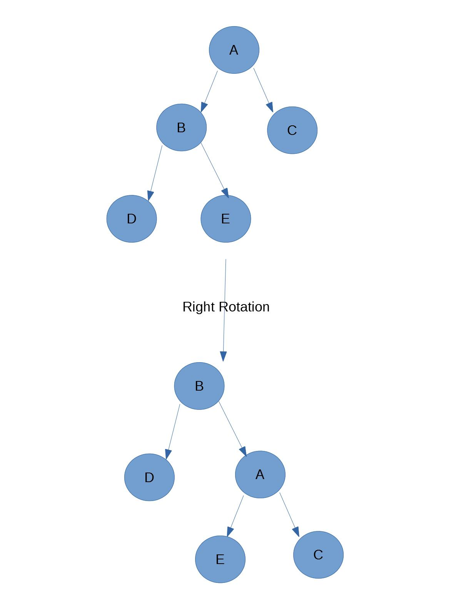

# Tree data structure
The tree has root, branches and leaves from top to bottom.
1. hierarchical (cover most real life problem), we can classify to different level, the more general things near the top and the more specific things near the bottom. (It will be suitable to the problem that can be sovled by subproblems)
2. the children of one node are independent of the children of another node. You can modify any nodes with affect other nodes.
3. each leaf node is unique.(The amount of leaves may be the number of all the situation. Maybe we can find the min/max path(least/most cost) from root to leaf)

Examples:
1. file system, the directories or folders are structured as a tree
2. HTML source code(the xpath and css selector describe the path from root to leaf)

Node: key(name) + payload(additional information used in an application)
Edge: connect with two nodes(NodeA -> NodeB). Every node (except the root) has one incoming edge and several outgoing edges.
Root: the only node that has no incoming edges.
Path: an ordered list of nodes that are connected by edges. (root->Node1-->Node2-->Leaf)
Sibling: the children who have the same parent.
Subtree: a set of nodes and edges comprised of a parent and all the descendants of that parent.
Leaf Node: The nodes have no children.
Level: the number of the edges from root to an node. The root node is zero.
Height: the max level of a tree

If each node in a tree has a maximum of two children, we say that the tree is a binary tree.

A tree consists of empty or a root with zero or more subtrees, each of which is also a tree. The root of each subtree is connected to the root of parent tree by an edge.


## list of lists representation
using the recursive list to implement the tree, the first item in the list is the root, the second item is the first subtree, the third item is the second subtree and so on. If the subtree has no item, there will be a empty list for future.

## Nodes and references
The class of tree will contain accessor(get/set) method to the root object, left reference to new subtree, right reference to new sutree. Insert to left/right tree, the old one need to pull down to the left subtree of adding one.

Parse Trees can be used to represent real-world constructions like sentences(for natural language programming?) or mathematical expressions(all expression can be treat as two result of subopetations and one operation).

## Tree traversals
There are three ways to access all nodes of tree. the order in which each node is visited is the key to differentiate the three patterns.

Prenode: read the root value firstly, and recursively do a preorder traversal of the left subtree, followed by a recursive preorder traversal of the right subtree. e.g. the ordering of book from front to back, the root is the head
Inorder: first do a recursive traversal of the left subtree, read the root, and do a recursive traversal of the right subtree. e.g. restore the expressions of math, the root is the operator
postorder: do a recursive traversal of the left and right subtree, followed by a visit to the root node. e.g. evaluate the parse tree which must know the result of the subtrees

## Priority Queue
The order of item in a priority queue is determined by their priority. Adding a new one may move all the way to the front. Using binary heap(internal one list, diagram like tree) to implement it with the O(log N) of enqueue and dequeue.

1. the queue of check-ins, VIP
2. the network traffic with tags to allow the most expensive line to pass firstly

What is it different from the ordered list?
the list in Python will required O(n) to search(linked list) or insert(normal list)

### Binary heap

To make the performance of binary heap to the logarithmic nature, we must keep the tree balanced. To keep the tree balancing, we create a complete binary tree by a single list. Fill the item from top to bottom, from left to right?

rooted binary tree: has a root node, every node has at most two children.
full binary tree: each node has zero or two children(subtree) for the root.
complete binary tree: except possibly the last, every level is completely filled, and all nodes in each level fill in the left as possible. (binary heap)
perfect binary tree: all leaf nodes are in the same level, and all interior nodes have two children. (the person must have two parent, the parent must have two grandparents)
balanced binary tree: the roughly same number of nodes in the left and right subtree

The position of left child will be 2p since the parent of node is p. The sum of level i from 0 will be 2^(i+1) - 1, the first item of next level i+1, will be 2^(i+1). The right child will be 2p + 1.

1. heap structure property (The single list is full, and the index 0 is 0 to make sure the the number and the position is same, and the position indexing from top,left to bottom,right)
2. heap order property: every node x with parent p, x >= p. every path from root to leaf will be increment or decrement.

The implementation of build heap from a list with insertion, shifting up to root, all the leaf nodes will require the logN operations, there are n/2 leaf nodes in the worst case, so It will be O(n log n) with shifting up.
But if building with the shift down, log N + (Log N - 1) * 2^1 + ... + 1 * n/4 = O(n). Each level has different operations. It' not based on the leaf nodes.
With the sorting with the binary heap, there are n/2 leaf nodes and each of them will requires log(n) operations in the worse case, therefore it will be O(N log N). 


## Search Tree
Implement Map data structure without size limit or rehash and collision.

The order is similar with the ordered list. The all nodes of left subtree will be less than the root, the all nodes of the right subtree will be greater than the root.

construct a tree, the new item is less than the root, and go to the left subtree. If it's greater then the left child of the root, there are two ways to implement.
1. push the new item into the right subtree of the left child of the root (default)
2. replace the position of the left child of the root, and push down the old one

The search tree makes sure all keys can be arranged in one dimension beginning at a point. To map the key to digits uniquely, and put it into the left or right subtree. If the key is duplicated, the value will be updated.

There are two type of method to implement the search tree:
1. inherit from the binary tree, to add or modify the specific method
2. a controller to the binary tree, just need to remember the root node of TreeNodes

When deleting a node, there are some situation.
1. not node
2. only root, need to compare the key
3. the node is leaf node
4. find the successor, a node will preserve the property of binary search tree with the deletion node, that is far most right in the left subtree of the root or fat most left node in the right subtree of the node. Fill the node need to delete with the data of successor and remove the successor.

To remove the successor, there are some situation.
1. leaf node, to cut down the link of the parent node
2. have one subtree, set the parent of successor to link to the subtree of the successor

Time complexity(comparison):
the limiting factor is the height of the tree, from O(log N), complete binary tree, to O(n), the one-side tree(ordered list, always left or right subtree) 
Maybe we can control the first node, root, by using three media method in the quick sort.

### balanced binary seach tree
It also has a name AVL tree by its inventor to make sure the tree remains balanced all the time to keep the performance O(log N).
For search binary tree, the limiting factor is the height of the tree. Maybe we can define the balanced binary search tree as the difference of the height of subtrees of any nodes is no more than one. The balanced factor (bf) is h(left) - h(right) will be in [-1, 0, 1]. e.g. bf == 2, it will be left heavy. 

For the bf = 1:
h=0, num_nodes = 1
h=1, num_nodes = 2
h=2, num_nodes = 2(h1) + 1(root) + 1(h0)
h=3, num_nodes = 4(h2) + 1(root) + 2(h1)
h=d, num_nodes = 1 + n(h(d-1)) + n(h(d-2))

F(i)/F(i-1) = golder ratio(gr) = (1 + √5) / 2, when i get larger
F(i) = gr^i/√5

N(h) = F(h+1) - 1 = gr^(h+1)/√5 - 1 ??

h = 1.44log(N)

So, the time complexity of AVL tree will be O(log N)

Adding an new item into tree as leaf node, the balance factor of new node is zero. But the parent of new nodes need to update. If the new leaf node is left child, the parent will add one, otherwise, right child subtract one. There are two base cases for updating balance factors:
1. up to root node
2. if one ancestor change to zero, the parents of it will be not changed(1, -1 --> 0) since there have been one child to take one level.

When updating the balance factor, the subtree near the leaf will be full to balance as possible. When one side is heavy enoughly, rebalancing will take place. Because we will build the AVL tree from scratch, there are two situation about the one-side heavy. Describe the left heavy for an example.
Ⅰ. The middle node in the middle( the child of the root, the parent of the leaf )

a. 
root--> left_node --> lleft_node

    (1) the left node will be the new root node, the AVL instance point to it (the benefit of the controller, not subclass)
    (2) the relationship of the old root and the old left node change to the new root and its new right child.

b. 
```
root --> right_subtree
 |
 ---> left_node --> lleft_node --> llleft_node
         |
         -----> lright_node 
```
    (1) To rebalance one node, we can put the node as the opposite child of the new node.
    (2) the left node will be the new root node, the AVL instance point to it (the benefit of the controller, not subclass)
    (3) The original lright child will save to a temporary varianle
    (4) the relationship of the old root and the old left node change to the new root and its new right child.
    (5) the old root left part will be empty, and the original lright child is less than the old root, it can plugin as the left child of the old root.
    (6) other parts will keep the same relationship.

For a left heavy tree need to rebalance, we will take the steps to right rotation.

1. create a temp variable to keep the r-left child of the old root
2. AVL instance point to the left child of the old root
3. change the relationship between the old root and the left child to the new root and the right child of the new node
4. plugins the temp variable as the left child of the old root.

Updating the balance factor after relancing:
1. Right Rotation


```
old_bal(A) = h(B) - h(C) = 1 + max( h(D) - h(E) )
new_bal(A) = h(E) - h(C)
new_bal(A) - old_bal(A) = h(E) - ( 1 + max( h(D), h(E) ) )
    = - ( 1 + max( h(D) - h(E), h(E) - h(E) ) )
    = - 1 - max( old_bal(B), 0 )

new_bal(A) = old_bal(A) - 1 - max( old_bal(B), 0 )

new_bal(B) = h(D) - h(A) = h(D) - ( 1 + max( h(C), h(E) ) )
old_bal(B) = h(D) - h(E)
new_bal(B) = old_bal(B) + h(E) - ( 1 + max( h(C), h(E) ) )
    = old_bal(B) - ( 1 + max( h(C)-h(E), h(E)-h(E) ) )
    = old_bal(B) - ( 1 + max( -new_bal(A), 0 ) )
    = old_bal(B) - ( 1 - min( new_bal(A), 0 ) )
    = old_bal(B) - 1 + min( new_bal(A), 0 )

# new root
new_bal(B) = old_bal(B) - 1 + min( new_bal(A), 0 )
```

2. Left Rotation
It's the reverse process of the right rotation.
```
old_bal(A) = new_bal(A) - 1 - max( new_bal(B), 0 )
old_bal(B) = new_bal(B) - 1 + min( old_bal(A), 0 )

new_bal(B) = old_bal(B) + 1 - min( old_bal(A), 0 )
# new root
new_bal(A) = old_bal(A) + 1 + max( new_bal(B), 0 )

```

Ⅱ. the middle node in the leaf ( the child of the child of the root )
We can do a rotation for the child of the root to make sure each node is heavy on one side.

Ⅲ. the real middle node in the root, this is perfect state we want.

The deletion of nodes will update the balance factor from the successor or leaf to the root(missing a level), while
1. the parent's balance factor to zero until the root