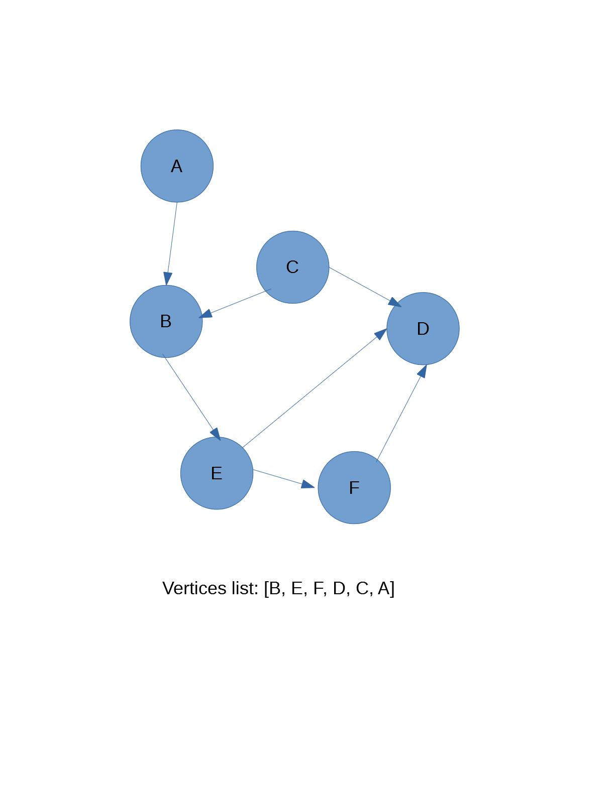
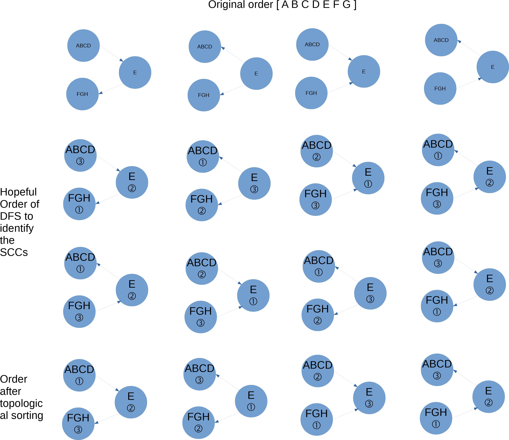
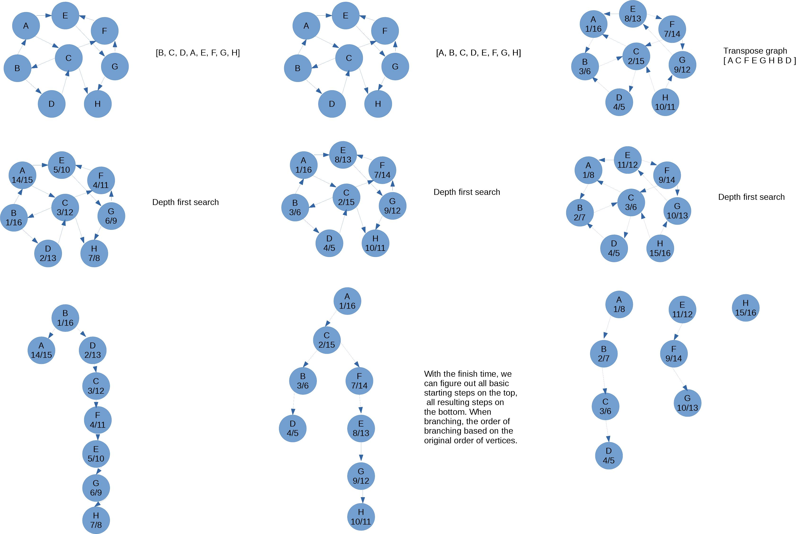
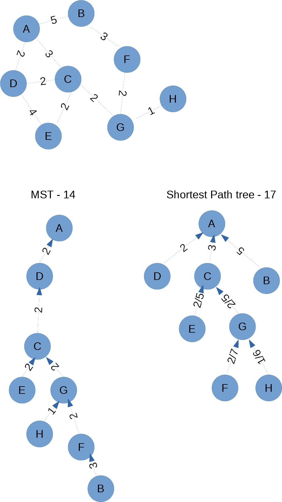

The tree can be thinked as a special kind of graph. And every problem can turn into a graph problem.

Real-life thing:
1. systems of roads
2. airline flights from city to city
3. the way of internet works

The components:
1. Vertex: node(key+payload)
2. edge: connect with two vertex to show the relationship of them, one or two way, the one way call "digraph" or directed graph
3. weight: a cost from one vertex to another, the property of edge, can be used to choose which is better

G = (V, E) (a set of vertices and a set of edges)
E = { (v, w) }

subgraph s = (e, v),  e ⊂ E, v ⊂ V
4. Path: the sequences of the vertices that are connected by edges, (V3, V4, V0, V1), (V0, V1) ∈ E

The unweighted path length is the number of edges
The weighted path length is the sum of the weights of all the edges in the path

5. cycle: in a directed graph, a path starts and ends at the same vertex

A graph with no cycles is called an acyclic graph. A directed graph with no cycles is called a directed acyclic graph or DAG. 

For a problem of graph, we can see there are a set of vertices or situations, for each one which will be related with the another and have the property of connection(like a small tree), so we can solve the problem with two dimensional way.

## Adjacency Matrix
The edge include all the infomation of the graph. There are three elements in a edge, so we can use two dimensional matrix to implement the graph. The row and column represent a vertex in the graph. The cell of intersection of row v, column w indicates if there is an edge from vertex v to vertex w. The cell's value is the weight of the edge from v to w. And the two vertices connecting are adjacent.

Advantage:
1. simple
2. for a small graph, it's easy to see which nodes are connected to others.

Disadvantage:
1. most of cell will be empty if the number of edges is large.(sparse)

The number of cell or edges will be required to fill the matrix fully is |V|^2. A matrix is full when every vertex is connected to every other vertex.

## Adjacency List
It likes unfixed columns table, each row vertex only keep the adjacent vertex. For more space efficient way to implement a sparsely connected graph is to use an adjacency list. In the graph, we will keep the vertex list. For each vertex, we will keep the id and the connectivity to others vertex with a dictionary, key is vertex, value is the weight of edge.

### The word ladder 
FOOL --> SAGE
Each time only change one letter and after change, the result must be a word.
One possible solution: fool --> pool --> poll --> pole --> pale --> sale --> sage

There are two question we need to consider:
1. How to build the graph, we need to know the result is a word since we change any one letter?
FOOL --> (possible intermedia words) --> (possible intermedia words) --> Sage

The graph is undirected and unweighted.

(1) A brute force solution, we can try change any one letter at FOOT, check every result and save as a word one, and loop through to find all result of the interior word until we find the SAGE? This solution will waste a lot of time and hard to reach the base case to find all solutions. The length of word is k, the number of four digits is g, one change will compare g*(26^k), and if longest path is l, the worst case will be l*g*(26^k).

(2) we have a range(|V|) of four digit word list, we can build from it. Create vertices for each words, and create an edge if the two words are different by one letter. It will require O(|V|^2) times comparisons.

(3) Since the words differential one letter will be connected, we can create all wildcard patterns, budges from the word list, and then put the word list into the budge lists, create all edges. The time complexity will be O(|V| + |E|).

If there are 5110 words with four digits, the implementation of adjacency matrix will take 5110^2 cells, but only about 53,286 edges exist, the matrix will only 0.2% of the cells filled.

2. after we build the graph, how can we find the path from FOOL to SAGE to fulfill the limit(particular steps, must use a particular word, the shortest path....)

How to save the graph data structure as image?
https://www.python-course.eu/networkx.php

## breadth first search

Find the shortest path without weight. Graph --> tree by remember the one explored

Given a graph and start point, like a gadar, we can search all the adjacent vertices to the start point, similar to all node in one level, and then search next level until there are no adjacent nodes left.

For searching, we can use color to mark up the node, have searched(black), ready to search(gray), unsearched(white). And use predecessor to record the parent node, use distance to record the edges from the start point(root) to it.

To finish the search level by level, we need to using a queue to keep the list of task whose color turn to gray. Unlike the recursion, go to one direction until the leaf. When we explore one node, we push the unexplored of the adjacent list of it into queue.

After the search, we can get the path of any target node with the predecessor.

If the number of vertices is |V| and the number of edges is |E|, the time complexity is O(V + E) to iterate over all nodes and all edges in worse case(not single standalone nodes) to build the breadth first tree.

To find the path from starting node to the target node, will be O(|V|) in worse case (a single long chain).

It's suitable for know all position to find the shortest path.

### Knight's tour
Target: move the knight over each square in the chessboard once.
Result: find the path connect all the vertices(8^2) in a single long chain
Maybe there are many solutions for this problem. Try with first one step to find one possible solution.
question we neeed to answer to solve the problem:
1. the start point of the knight
2. how to avoid the dead end and control the knight pass all squares

For question 2, we can build a graph for each square and its the avaiable legal movement. The graph will contain all the actions we can take. We need to find a way to iterate over all the nodes once, like the recursive tree to find the far-most leaf node(weight of root). The edge is the legal moves with two squares.

The edges will be 336, if use the adjacent matrix to store the edges, it will require 64^2 = 4096 cells, there is only 8.2% full.

To solve the problem, we can use the depth first search(DFS) by exploring one branch of the tree as deeply as possible at one time.
To implement the DFS, we can build part of tree or all of tree.
1. part of tree, as we get the weight we want(one solution), the tree will return and stop.
2. all of tree, to find all solutions and require more power of computer.

Specifically, we need to find a path contains 64 all nodes and 63 level of root. So the base case:
1. when the depth is 63 and the current node is unexplored, it will be the solution and true
2. when it reach an dead end(no more legal moves possible), we need to set the node to unexplored, return to the parent of node to try another same level node.

To move to the base case, we start at one node, to try one of the moves firstly and depth increase 1.

we can use a extra stack or the reference of the vertex(to return the leaf node to traverse) to keep track of the path.

We can make a circular tours that start and end at the same square. Like the real tour of singer. And with this problem, each move will cost the same effort, if it's not, how to find a path with least cost.

Complexity:
In worse case, we will build a 63(n) height tree and each node has 8(k) children. So the time complexity is O(k^n), 2<=k<=8. The space Complexity will be O(n).

We can speed up the algorithm by ordering the adjacent list to go to next exploring. Visiting the squares with fewest avaiable moves first push the knight to visit the area of the edges of the board first. This ensures the knight will visit hard-to-reach corners and can use the middle squares to hop across the board only when necessary.(like spiral towards the center?) On the other hand, go with the most avaiable squares will push the knigth to middle first, and go to one side of board, the middle have visited a lot, it's easy to get stranded on one side of board.

Utilizing this kind of knowledge to speed up the algorithm is called a heuristic, often used in the field of AI. This particular heuristic is called Warnsdorff’s algorithm.

## general depth first search
The depth first search algorithm is to solve the maze originally. Its goal is to search or build as deeply as possible, and connecting as many nodes in the graph as possible and branching where necessary. Not like the knight' tour, to find the deepest path to connect all nodes. We need to build the trees for all nodes to figure out all situations and no depend on one starting node, so it's possible to create more than one tree, called depth first forest.

The order of vertices list will influence the depth first forest.

If the Vertices list is [B, E, F, D, C, A], the first branching will be [B, E, F, D], and the A will be one-node tree.
But if the Vertices list is [A, B, C, D, E, F], the first branching will be [A, B, E, D].
So should we sort the vertices before we build the depth first forest? And what about the breadth first forest?

The breadth first search use the queue explicitly to build the tree level by level, and the depth first search use the stack implicitly by recursive call to go as deeper as possible and branching.

We will use two additional instance variable of Vertex class to keep track of the number of steps before one node exploring, discoverey, and the number of steps after searching one node and its subtree, finish. Since the times are required by two method, we can use class implementation with time property by avoiding to pass the time variable. In a depth first search tree, children will have a later discovery time and a earlier finish time than their parent (parenthesis property).

Application:
1. finding connected components
2. solve mazz with one solution
3. web crawler

Time complexity:
The depth first search will iterate over all nodes, and build the tree by iterating every edges of nodes once, so it will require O(V+E), the space cost is O(V) in worse case, a single long chain. But build the tree with repetition, like the knight's tour to find the deepest path, it will require k^d(k is average branching factor, d is the depth), the space cost is O(k*d)??

The DFS is suitable for inside a situation and only know the base rule and doesn't know all the position of graph or hard to build the graph.

### topological sort
For directed acyclic graphs, we want to know the order of vertices, steps required to make something successful, so the topological sorting is a good choice, that descending by the finish time of vertices. But for a vertex take a long idle time, we can do other non-dependant thing?

DAG(directed acyclic graphs) can represent the following situation:
1. project, take many steps towards one goal
2. multiplying matrices?
3. precedence charts for optimizing database queries?

Because the goal will be the last step, leaf node, all branch will be towards the leaf node, it will look like a vertical mirror tree. And the goal will be smallest finish time, instead of the unpredictable dicovery time.

### Strongly connected components
To transform the web pages to graphs like search engine, we can see some webpages will be linked together around some topics. Each of them can find a path to other pages on some level, like the real world, that can be divided into different level, every item of one level have strongly connection with others, but only some of items have links with other levels.
To find the clusters maybe can help us to analyze some information by groups.
How to find the clusters?
There is an strongly connected components(SCC) algorithm to solve it. SCC can be defined as one of the largest subset of vertices, and in the sublist each pairs of v, w nodes can find a path and a back path between both of them. Each vertex of SCC will have at least one input and one output. And in the transposition of original graph, all edges is reverse again the origin, the vertices of SCC also can link to others.

Inside an SCC, we can use depth first search to find out all node with one DFS tree. But the relationship among the SCCs will effect the DFS.
For one SCC, there are two relationship of outside the SCC:
1. the vertex of another SCC points into the SCC. When starting search inside the SCC, this situation will not influence on it.
2. one vertex of the SCC points out to another SCC. When starting search inside the SCC, this situation will influence on it. So we hope the other SCCs pointed out to can be searched before it and cannot be seached again. We can use the finish time of DFS to achieve it.

Listing all situations of relationship of the SCCs, and giving the resulting order we need to split the SCC to standalone trees, we can conclude the steps:
1. Do a DFS to topological sort
2. compute a new transposed graph
3. build the depth first forest by the order of topological sort
4. output each trees as the SCCs list

Application 

### Shortest path with a weighted graph
Beginning at a vertex, we calculate the distance of its adjacent vertices, and select the shortest one to go. We assumpt that the distance is very large before we explore it. And we use the priority queue to keep track of the smallest distance of vertices.

The weight of edge must be positive, because the cost need to increase to iterate all vertices, if there is negative weight, the vertices of edge will go each other repeatly since the cost is deceasing and the algotithm would never exit.

So if the weights include a negative value, we need to shift all weights until all weights to positive.

But for the route messages on the Internet, the Dijkstra algorithm is not practice. Beacause each vertex/router will need to know the complete graph of the Internet to find the path, or broadcasting to all adjacent routers that will result receive multi-messages. For more detail, we can see https://en.wikipedia.org/wiki/Distance-vector_routing_protocol

Time complexity:
For each vertex, it need to retrieve from the heap, which takes O(V*log(V))
For each edge, we need to calculate the costs and percolate up the vertex, that take O(E*log(V))
So the sum of the performance is O((E+V)*log(V))

### Prim's Minimun Spanning Tree algorithm
For a broadcast problem, we need to efficiently transfer a piece of infomation to anyone and everyone who may be listening.

Since each time the infomation is unique, the host need to send only once is better than send messages to each listener again and again. Let the router broadcast the message left the host. But if each router send the message to its neighbours(uncontrolled flooding) and set the time to live(ttl, decrease to 0) to limit the most distant, it will also take more extra traffic to cover all edges for some nodes have receive.

We want to build a map or paths to every nodes from a starting node with lowest costs. And use this map or paths to broadcast. Since each node only receive one message, and there are not cycle, so the map will be like a tree. The map or paths can be called minimun spanning tree (T). T is an acyclic subset of E that connects all the vertices in V. And the sum of the weights of the edges in T is minimized.

How to minimize the costs of the tree?
Maybe we can use the greedy algorithm to find the smallest weight of edge each time from the starting vertex without any limit and just connect all nodes.

We need to notice that the node has received would not receive again even its edge's weight is lowest. The edge add to tree must connect with one in tree and one not in tree.

The greedy algorithm is for the whole cost of problem and connect nodes as much as possible with min/max value.

